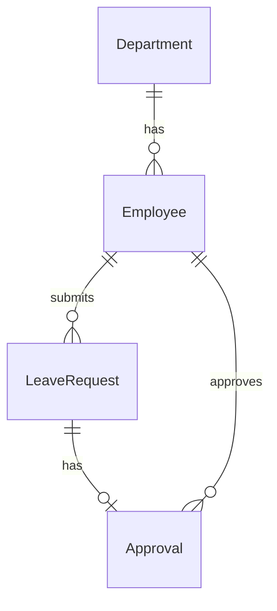
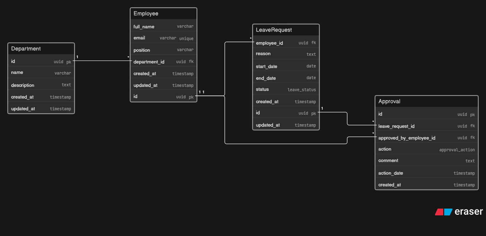

# Obiri HR System

A complete Human Resources management system built with NestJS, Angular, and SQLite (development) / PostgreSQL (production).

## Tech Stack

| Layer    | Technology                                    |
| -------- | --------------------------------------------- |
| Frontend | Angular 19, TypeScript, Reactive Forms        |
| Backend  | NestJS 10, TypeScript, TypeORM                |
| Database | SQLite (dev) / PostgreSQL 16 (prod)            |
| Testing  | Jest, Postman                                 |

## Architecture





## Features

- **Departments** — Create, Read, Update, Delete departments
- **Employees** — Create, Read, Update, Delete employees, Assign to department
- **Leave Requests** — Submit, View status, Approve, Reject with timestamp and approver tracking

## Project Structure

```
Obiri/
├── backend/                # NestJS API
│   ├── src/
│   │   ├── departments/    # Department module (entity, controller, service, DTOs)
│   │   ├── employees/      # Employee module
│   │   ├── leave-requests/ # Leave Request module
│   │   ├── approval/       # Approval entity
│   │   ├── common/         # Exception filters
│   │   ├── app.module.ts   # Root module with TypeORM config
│   │   ├── main.ts         # Entry point with CORS, ValidationPipe
│   │   └── seed.ts         # Database seeder
│   └── test/               # Jest unit tests
├── frontend/               # Angular SPA
│   └── src/app/
│       ├── departments/    # Department list + form components
│       ├── employees/      # Employee list + form components
│       ├── leave-requests/ # Leave request list + form components
│       ├── models/         # TypeScript interfaces
│       └── services/       # HTTP client services
├── database/               # SQL init scripts
├── docker-compose.yml      # PostgreSQL container
└── README.md
```

## Quick Start

### Prerequisites

- Node.js >= 22.x
### Database

SQLite is used for development — no server setup needed. The database file (`obiri.db`) is created automatically by TypeORM when the backend starts.

### Backend

```bash
cd backend
npm install
npm run start:dev    # http://localhost:3000
```

### Seed Data

```bash
npm run seed         # Creates departments, employees, sample leave requests
```

### Frontend

```bash
cd frontend
npm install
npx ng serve         # http://localhost:4200
```

### Run Tests

```bash
cd backend
npx jest
```

## API Endpoints

### Departments

| Method | Endpoint                     | Description         |
| ------ | ---------------------------- | ------------------- |
| POST   | `/api/departments`           | Create department   |
| GET    | `/api/departments`           | List all departments|
| GET    | `/api/departments/:id`       | Get department by ID|
| PUT    | `/api/departments/:id`       | Update department   |
| DELETE | `/api/departments/:id`       | Delete department   |

### Employees

| Method | Endpoint                              | Description            |
| ------ | ------------------------------------- | ---------------------- |
| POST   | `/api/employees`                      | Create employee        |
| GET    | `/api/employees`                      | List all employees     |
| GET    | `/api/employees/:id`                  | Get employee by ID     |
| PUT    | `/api/employees/:id`                  | Update employee        |
| DELETE | `/api/employees/:id`                  | Delete employee        |
| POST   | `/api/employees/:id/assign-department`| Assign to department   |

### Leave Requests

| Method | Endpoint                            | Description                  |
| ------ | ----------------------------------- | ---------------------------- |
| POST   | `/api/leave-requests`               | Submit leave request         |
| GET    | `/api/leave-requests`               | List all leave requests      |
| GET    | `/api/leave-requests/:id`           | Get leave request details    |
| GET    | `/api/leave-requests/:id/status`    | Get current leave status     |
| PUT    | `/api/leave-requests/:id/approve`   | Approve leave request        |
| PUT    | `/api/leave-requests/:id/reject`    | Reject leave request         |

## Environment Variables (backend/.env)

| Variable      | Default                |
| ------------- | ---------------------- |
| DB_PATH       | obiri.db               |
| DB_LOGGING    | false                  |
| PORT          | 3000                   |
| CORS_ORIGIN   | http://localhost:4200   |

## Business Rules

1. **Department names must be unique** — `ConflictException` on duplicate
2. **Employee emails must be unique** — `ConflictException` on duplicate
3. **Leave end date must be after start date** — `BadRequestException`
4. **Leave start date cannot be in the past** — `BadRequestException`
5. **No overlapping leave requests** — `BadRequestException` for date conflicts
6. **Employees cannot approve their own leave** — `BadRequestException`
7. **Only pending requests can be approved/rejected** — `BadRequestException`
8. **Approver must be a valid employee** — `NotFoundException`
9. **Department must exist for assignment** — `NotFoundException`
10. **All approval/rejection records timestamps and approver IDs** — audit trail

## Test Report

```
Test Suites: 3 passed, 3 total
Tests:       28 passed, 28 total
  - Department CRUD:       5 passed
  - Employee CRUD:         6 passed
  - Department Assignment: 2 passed
  - Leave Submission:      3 passed
  - Approval:              3 passed
  - Rejection:             1 passed
  - Status Updates:        1 passed
  - Validation:            3 passed
  - Error Handling:        4 passed
```
